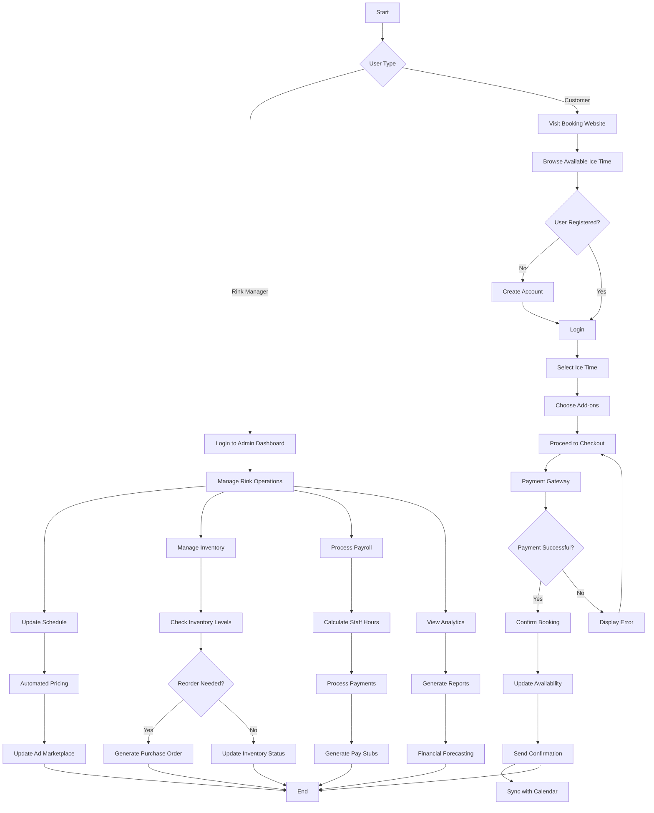
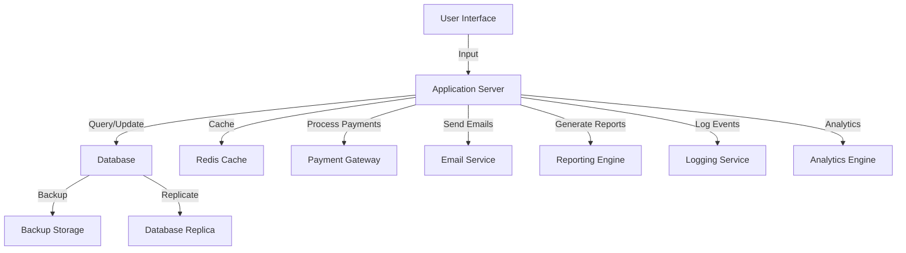

# 1. Introduction

## 1.1 Purpose

The purpose of this Software Requirements Specification (SRS) document is to provide a comprehensive and detailed description of the Ice Rink Management and Booking System. This document is intended for the following audience:

1. Software development team
2. Project managers
3. Quality assurance testers
4. Stakeholders, including ice rink owners and operators
5. System architects and designers

This SRS aims to clearly define the functional and non-functional requirements of the system, ensuring a shared understanding among all parties involved in the development, implementation, and use of the software.

## 1.2 Scope

The Ice Rink Management and Booking System is a comprehensive software solution designed to revolutionize ice rink operations and booking processes. This all-encompassing platform will serve as a complete replacement for existing solutions, addressing the complex needs of ice rink management while enhancing the user experience for both operators and customers.

### 1.2.1 Goals

1. Streamline and automate ice rink management processes
2. Optimize ice time utilization and revenue generation
3. Enhance user experience for rink operators, skaters, coaches, and teams
4. Provide a centralized platform for all aspects of ice rink operations
5. Offer real-time insights and analytics for informed decision-making

### 1.2.2 Benefits

1. Significant reduction in time and effort spent on ice time management
2. Improved resource utilization and operational efficiency
3. Increased revenue through optimized scheduling and pricing
4. Enhanced customer satisfaction and loyalty
5. Streamlined operations under a single, integrated platform
6. Data-driven insights for strategic planning and growth

### 1.2.3 Core Functionalities

The Ice Rink Management and Booking System will include the following core components and functionalities:

1. Internal Scheduling System
   - Real-time availability tracking and updates
   - Automated pricing based on various factors
   - Support for multiple booking types (season-long, public skates, leagues, drop-in sessions)
   - Flexible ice area allocation (full sheet, half ice, eighth of ice)

2. External-facing Booking Functionality
   - User-friendly interface for customers to book ice time
   - Secure online payment processing
   - User profiles for frequent bookers
   - Mobile-friendly design for on-the-go bookings
   - Integration with popular calendar applications

3. Cross-channel Marketing Campaign Management
   - Tools for creating and managing marketing campaigns
   - Integration with email, social media, and other marketing channels

4. On-ice Insurance Integration
   - Seamless integration with insurance providers
   - Automated insurance verification and processing

5. Lending Services Management
   - Inventory tracking for rental equipment
   - Reservation and check-out system for lending items

6. Payroll Management
   - Staff scheduling and time tracking
   - Automated payroll processing and reporting

7. Procurement and Inventory Management
   - Stock level tracking and automated reordering
   - Supplier management and purchase order generation

8. Ad Marketplace
   - Platform for selling and managing advertising space within the rink

9. Reporting and Analytics
   - Comprehensive reporting tools for rink managers
   - Financial forecasting and analysis
   - Customer behavior insights and trends

10. Customer Relationship Management (CRM)
    - Customer data management and segmentation
    - Communication history tracking
    - Personalized marketing and engagement tools

11. Point-of-Sale (POS) Integration
    - Integration with pro shop and concession POS systems
    - Unified reporting and inventory management

By encompassing these core functionalities, the Ice Rink Management and Booking System aims to become the new industry standard, capable of efficiently and effectively managing all aspects of ice rink operations while providing an exceptional experience for both operators and users.

## 2. Product Description

### 2.1 Product Perspective

The Ice Rink Management and Booking System is a comprehensive, standalone software solution designed to revolutionize the ice rink industry. It operates as a centralized platform that integrates various aspects of ice rink operations, replacing existing fragmented solutions. The system interacts with external entities such as payment gateways, insurance providers, and marketing channels to provide a holistic management experience.

Key integration points include:

1. Payment gateways for secure online transactions
2. Insurance provider systems for on-ice insurance verification
3. Email and social media platforms for marketing campaigns
4. Calendar applications for seamless booking integration
5. Point-of-sale systems for pro shops and concessions
6. Banking systems for payroll processing

The system is designed as a cloud-based solution, ensuring high availability, scalability, and real-time access across multiple devices and locations.

### 2.2 Product Functions

The Ice Rink Management and Booking System offers the following high-level functions:

1. Ice Time Management
   - Real-time scheduling and availability tracking
   - Automated pricing based on various factors
   - Support for multiple booking types and ice area allocations

2. Online Booking and Payment
   - User-friendly interface for customers to book ice time
   - Secure payment processing
   - User profile management

3. Marketing and Customer Relationship Management
   - Cross-channel marketing campaign management
   - Customer data management and segmentation
   - Personalized engagement tools

4. Operations Management
   - On-ice insurance integration and verification
   - Lending services and equipment inventory management
   - Staff scheduling and payroll processing
   - Procurement and inventory management for rink supplies

5. Financial Management
   - Comprehensive reporting and analytics
   - Financial forecasting and analysis
   - Integration with point-of-sale systems

6. Ad Marketplace
   - Platform for managing and selling advertising space within the rink

7. Mobile Access
   - Mobile-friendly design for on-the-go management and bookings

### 2.3 User Characteristics

The Ice Rink Management and Booking System caters to diverse user groups with varying levels of technical expertise:

1. Rink Managers and Administrators
   - High level of system access and control
   - Typically have moderate to advanced technical skills
   - Require comprehensive training on all system features

2. Staff Members (e.g., front desk, coaches)
   - Moderate level of system access
   - Various levels of technical skills
   - Need training on specific system modules relevant to their roles

3. Individual Skaters
   - Basic system access for booking and profile management
   - Wide range of technical skills, from novice to advanced
   - Require an intuitive, user-friendly interface

4. Team Representatives and League Organizers
   - Moderate system access for managing team bookings and schedules
   - Generally have basic to intermediate technical skills
   - Need training on team management features

5. Parents and Guardians
   - Basic system access for booking and managing children's activities
   - Varying levels of technical skills
   - Require a simple, straightforward booking process

6. Advertisers
   - Limited access to ad marketplace features
   - Typically have basic to intermediate technical skills
   - Need an easy-to-use interface for managing ad placements

### 2.4 Constraints

1. Regulatory Constraints
   - Compliance with data protection regulations (e.g., GDPR, CCPA)
   - Adherence to financial regulations for payment processing
   - Compliance with accessibility standards (e.g., WCAG 2.1)

2. Technical Constraints
   - Integration limitations with legacy systems at some ice rinks
   - Varying internet connectivity speeds at different locations
   - Diverse range of devices used by end-users

3. Operational Constraints
   - Need for minimal system downtime during peak booking periods
   - Requirement for real-time data synchronization across all modules
   - Scalability to handle high traffic during popular booking times

4. Security Constraints
   - Strict data encryption requirements for personal and financial information
   - Need for robust user authentication and authorization mechanisms
   - Regular security audits and penetration testing

5. Usability Constraints
   - System must be intuitive for users with varying technical skills
   - Interface must be accessible on different devices and screen sizes
   - Support for multiple languages may be required for diverse user bases

### 2.5 Assumptions and Dependencies

Assumptions:
1. Ice rinks have reliable internet connectivity for system access
2. Users have access to devices capable of running modern web browsers
3. Rink managers are willing to transition from existing systems to the new platform
4. There is a consistent set of core operations across different ice rinks

Dependencies:
1. Availability and reliability of third-party payment gateway services
2. Cooperation from insurance providers for seamless integration
3. Compatibility with popular calendar applications for booking integration
4. Availability of accurate and up-to-date data from integrated point-of-sale systems
5. Timely updates from regulatory bodies regarding compliance requirements
6. Continuous support and updates from cloud infrastructure providers
7. Availability of skilled personnel for system implementation and support

## 2.6 Process Flowchart

The following process flowchart illustrates the high-level flow of the Ice Rink Management and Booking System, showcasing the main interactions between users, the system, and external services.

This flowchart provides a visual representation of the main processes within the Ice Rink Management and Booking System. It illustrates the flow for both rink managers and customers, showcasing key functionalities such as scheduling, booking, inventory management, payroll processing, and reporting. The chart also highlights the integration with external services like payment gateways and calendar applications, ensuring a comprehensive view of the system's operations.

# 3. Functional Requirements

## 3.1 Ice Time Management

### ID
F001

### DESCRIPTION
The Ice Time Management feature allows for real-time scheduling, availability tracking, and automated pricing for various types of ice bookings.

### PRIORITY
High

### TABLE OF FUNCTIONAL REQUIREMENTS

| ID | Requirement | Description |
|----|-------------|-------------|
| F001.1 | Real-time scheduling | The system shall provide real-time updates to the ice rink schedule, reflecting changes immediately across all user interfaces. |
| F001.2 | Multiple booking types | The system shall support various booking types including season-long bookings, public skates, adult hockey leagues, drop-in sessions, and split slots for multiple simultaneous lessons. |
| F001.3 | Ice area allocation | The system shall allow for booking of full sheet, half ice, or eighth of the ice. |
| F001.4 | Automated pricing | The system shall automatically calculate prices based on factors such as time, ice area, season, and demand. |
| F001.5 | Availability tracking | The system shall track and display real-time availability of ice time slots. |
| F001.6 | Conflict resolution | The system shall prevent double-bookings and provide alerts for scheduling conflicts. |

## 3.2 Online Booking and Payment

### ID
F002

### DESCRIPTION
The Online Booking and Payment feature provides a user-friendly interface for customers to book ice time and make secure online payments.

### PRIORITY
High

### TABLE OF FUNCTIONAL REQUIREMENTS

| ID | Requirement | Description |
|----|-------------|-------------|
| F002.1 | User-friendly booking interface | The system shall provide an intuitive, easy-to-use interface for customers to browse and book available ice time. |
| F002.2 | Secure payment processing | The system shall integrate with a secure payment gateway to process online payments for bookings. |
| F002.3 | User profiles | The system shall allow users to create and manage profiles, storing booking preferences and payment information. |
| F002.4 | Mobile-friendly design | The booking interface shall be responsive and fully functional on mobile devices. |
| F002.5 | Calendar integration | The system shall allow users to add bookings to popular calendar applications. |
| F002.6 | Booking modifications | Users shall be able to modify or cancel their bookings within specified time limits. |

## 3.3 Marketing and CRM

### ID
F003

### DESCRIPTION
The Marketing and CRM feature enables cross-channel marketing campaign management and customer relationship management.

### PRIORITY
Medium

### TABLE OF FUNCTIONAL REQUIREMENTS

| ID | Requirement | Description |
|----|-------------|-------------|
| F003.1 | Campaign management | The system shall provide tools for creating, managing, and tracking marketing campaigns across various channels. |
| F003.2 | Customer segmentation | The system shall allow for segmentation of customers based on various criteria for targeted marketing. |
| F003.3 | Email integration | The system shall integrate with email platforms for sending marketing communications and notifications. |
| F003.4 | Social media integration | The system shall allow posting of promotions and updates to connected social media accounts. |
| F003.5 | Customer data management | The system shall maintain comprehensive customer profiles including contact information, booking history, and preferences. |
| F003.6 | Communication history | The system shall track all communications with customers for reference and analysis. |

## 3.4 Operations Management

### ID
F004

### DESCRIPTION
The Operations Management feature handles various aspects of rink operations including insurance, lending services, payroll, and inventory management.

### PRIORITY
High

### TABLE OF FUNCTIONAL REQUIREMENTS

| ID | Requirement | Description |
|----|-------------|-------------|
| F004.1 | On-ice insurance integration | The system shall integrate with insurance providers for automated verification and processing of on-ice insurance. |
| F004.2 | Lending services management | The system shall track inventory of rental equipment and manage reservations and check-outs. |
| F004.3 | Staff scheduling | The system shall provide tools for creating and managing staff schedules. |
| F004.4 | Payroll processing | The system shall automate payroll calculations based on staff schedules and hourly rates. |
| F004.5 | Inventory management | The system shall track stock levels of rink supplies and generate automated reorder notifications. |
| F004.6 | Supplier management | The system shall maintain a database of suppliers and allow for automated purchase order generation. |

## 3.5 Financial Management

### ID
F005

### DESCRIPTION
The Financial Management feature provides comprehensive reporting, analytics, and forecasting tools for rink finances.

### PRIORITY
High

### TABLE OF FUNCTIONAL REQUIREMENTS

| ID | Requirement | Description |
|----|-------------|-------------|
| F005.1 | Financial reporting | The system shall generate comprehensive financial reports including revenue, expenses, and profitability. |
| F005.2 | Analytics dashboard | The system shall provide a dashboard with key performance indicators and data visualizations. |
| F005.3 | Forecasting tools | The system shall offer financial forecasting capabilities based on historical data and future bookings. |
| F005.4 | POS integration | The system shall integrate with point-of-sale systems for pro shops and concessions for unified financial reporting. |
| F005.5 | Revenue optimization | The system shall provide recommendations for pricing and scheduling to maximize revenue. |
| F005.6 | Expense tracking | The system shall allow for categorization and tracking of all rink-related expenses. |

## 3.6 Ad Marketplace

### ID
F006

### DESCRIPTION
The Ad Marketplace feature provides a platform for managing and selling advertising space within the rink.

### PRIORITY
Low

### TABLE OF FUNCTIONAL REQUIREMENTS

| ID | Requirement | Description |
|----|-------------|-------------|
| F006.1 | Ad space inventory | The system shall maintain an inventory of available advertising spaces within the rink. |
| F006.2 | Ad booking interface | The system shall provide an interface for advertisers to browse and book available ad spaces. |
| F006.3 | Pricing management | The system shall allow for flexible pricing of ad spaces based on factors such as location, duration, and event type. |
| F006.4 | Ad performance tracking | The system shall provide metrics on ad performance and visibility. |
| F006.5 | Advertiser management | The system shall maintain profiles for advertisers including contact information and booking history. |
| F006.6 | Ad content approval | The system shall include a workflow for approving ad content before display. |

# 4. Non-Functional Requirements

## 4.1 Performance

| ID | Requirement | Description |
|----|-------------|-------------|
| NF001 | Response Time | The system shall respond to user interactions within 2 seconds under normal load conditions. |
| NF002 | Page Load Time | All web pages shall load within 3 seconds on a standard broadband connection. |
| NF003 | Concurrent Users | The system shall support at least 1000 concurrent users without degradation in performance. |
| NF004 | Database Query Time | Database queries shall execute within 1 second for 95% of requests. |
| NF005 | API Response Time | API calls shall return responses within 500 milliseconds for 99% of requests. |
| NF006 | Resource Utilization | The system shall utilize no more than 80% of available CPU and memory resources under peak load. |

## 4.2 Safety

| ID | Requirement | Description |
|----|-------------|-------------|
| NF007 | Data Backup | The system shall perform automated backups of all data at least once every 24 hours. |
| NF008 | Disaster Recovery | The system shall have a disaster recovery plan that ensures recovery of all critical data within 4 hours of a system failure. |
| NF009 | Fault Tolerance | The system shall continue to operate with degraded performance in case of failure of any single component. |
| NF010 | Data Integrity | The system shall maintain data integrity through transaction logging and rollback mechanisms. |
| NF011 | Error Handling | The system shall gracefully handle and log all errors without exposing sensitive information to users. |

## 4.3 Security

| ID | Requirement | Description |
|----|-------------|-------------|
| NF012 | Authentication | The system shall use multi-factor authentication for all user logins. |
| NF013 | Authorization | The system shall implement role-based access control (RBAC) to restrict access to sensitive functions and data. |
| NF014 | Data Encryption | All sensitive data shall be encrypted at rest using AES-256 encryption and in transit using TLS 1.3. |
| NF015 | Password Policy | The system shall enforce a strong password policy requiring at least 12 characters, including uppercase, lowercase, numbers, and special characters. |
| NF016 | Session Management | User sessions shall expire after 30 minutes of inactivity. |
| NF017 | Audit Logging | The system shall maintain detailed audit logs of all security-relevant events. |
| NF018 | Privacy | The system shall comply with GDPR and CCPA requirements for user data privacy and protection. |

## 4.4 Quality

### 4.4.1 Availability

| ID | Requirement | Description |
|----|-------------|-------------|
| NF019 | Uptime | The system shall maintain 99.9% uptime, excluding scheduled maintenance. |
| NF020 | Maintenance Window | Scheduled maintenance shall occur during off-peak hours and be limited to 4 hours per month. |

### 4.4.2 Maintainability

| ID | Requirement | Description |
|----|-------------|-------------|
| NF021 | Code Standards | All code shall adhere to agreed-upon coding standards and be thoroughly documented. |
| NF022 | Modularity | The system shall be designed with a modular architecture to facilitate easy maintenance and updates. |
| NF023 | Version Control | All source code and configuration files shall be managed using a version control system (e.g., Git). |

### 4.4.3 Usability

| ID | Requirement | Description |
|----|-------------|-------------|
| NF024 | Intuitive Interface | The user interface shall be intuitive, requiring no more than 30 minutes of training for basic operations. |
| NF025 | Accessibility | The system shall comply with WCAG 2.1 Level AA accessibility guidelines. |
| NF026 | Multilingual Support | The system shall support at least English and French languages. |

### 4.4.4 Scalability

| ID | Requirement | Description |
|----|-------------|-------------|
| NF027 | Horizontal Scaling | The system shall be capable of horizontal scaling to handle increased load by adding more server instances. |
| NF028 | Data Growth | The system shall be designed to efficiently handle data growth of up to 1TB per year. |

### 4.4.5 Reliability

| ID | Requirement | Description |
|----|-------------|-------------|
| NF029 | Mean Time Between Failures | The system shall have a mean time between failures (MTBF) of at least 5000 hours. |
| NF030 | Recovery Time | In the event of a system failure, the recovery time objective (RTO) shall be less than 1 hour. |

## 4.5 Compliance

| ID | Requirement | Description |
|----|-------------|-------------|
| NF031 | Data Protection | The system shall comply with GDPR and CCPA requirements for data protection and privacy. |
| NF032 | Financial Compliance | The system shall comply with PCI DSS standards for handling credit card information. |
| NF033 | Accessibility Standards | The system shall adhere to ADA and Section 508 accessibility standards. |
| NF034 | Industry Standards | The system shall follow relevant ISO standards for quality management (ISO 9001) and information security (ISO 27001). |
| NF035 | Local Regulations | The system shall be adaptable to comply with local regulations in different jurisdictions where it may be deployed. |

These non-functional requirements ensure that the Ice Rink Management and Booking System not only meets its functional objectives but also delivers a high-quality, secure, and compliant solution that can scale and perform reliably under various conditions.

# 5. Data Requirements

## 5.1 Data Models

The Ice Rink Management and Booking System will utilize a relational database management system to store and manage data. The following entity-relationship diagram illustrates the core data model for the system:

This diagram represents the core entities and their relationships in the system. Additional tables and relationships will be implemented to support features such as marketing campaigns, insurance integration, and inventory management.

## 5.2 Data Storage

### 5.2.1 Database Management System

The system will use a robust, scalable relational database management system such as PostgreSQL to ensure data integrity, performance, and scalability.

### 5.2.2 Data Retention

- Booking and financial data will be retained for a minimum of 7 years to comply with financial regulations.
- User profile data will be retained as long as the account is active, with an option for users to request data deletion in compliance with GDPR and CCPA.
- Operational data (schedules, equipment logs, etc.) will be retained for 2 years for analysis and auditing purposes.

### 5.2.3 Data Redundancy and Backup

- The database will be configured with real-time replication to ensure data redundancy.
- Full database backups will be performed daily and stored in geographically diverse locations.
- Incremental backups will be performed hourly to minimize data loss in case of system failure.
- All backups will be encrypted using AES-256 encryption.

### 5.2.4 Data Recovery

- The system will implement a robust disaster recovery plan with the following key components:
  - Automated failover to replica databases in case of primary database failure.
  - Regular testing of backup restoration processes.
  - Documented procedures for various disaster scenarios.
- The recovery time objective (RTO) for critical data will be less than 1 hour.
- The recovery point objective (RPO) will be no more than 15 minutes of data loss in worst-case scenarios.

### 5.2.5 Scalability

- The database architecture will support horizontal scaling through sharding for high-traffic tables.
- Caching mechanisms (e.g., Redis) will be implemented to reduce database load for frequently accessed data.
- The system will be designed to efficiently handle data growth of up to 1TB per year, with the ability to scale beyond as needed.

## 5.3 Data Processing

### 5.3.1 Data Security

- All sensitive data will be encrypted at rest using AES-256 encryption.
- Data in transit will be protected using TLS 1.3 encryption.
- Access to the database will be restricted to authorized personnel and services only, using strong authentication mechanisms.
- Regular security audits and penetration testing will be conducted to ensure data protection.

### 5.3.2 Data Flow

The following diagram illustrates the high-level data flow within the Ice Rink Management and Booking System:

This data flow diagram shows the main components and how data moves between them:

1. User interactions are processed by the application server.
2. The application server interacts with the database for data retrieval and storage.
3. Frequently accessed data is cached in Redis to improve performance.
4. External services such as payment gateways and email services are integrated for specific functionalities.
5. A reporting engine generates various reports based on the data.
6. The database is regularly backed up and replicated for redundancy.
7. All significant events are logged for auditing and troubleshooting purposes.
8. An analytics engine processes data to provide insights and support decision-making.

### 5.3.3 Data Validation and Integrity

- Input validation will be performed at both client-side and server-side to ensure data integrity.
- Database constraints and triggers will be implemented to maintain data consistency.
- Regular data integrity checks will be scheduled to identify and rectify any inconsistencies.

### 5.3.4 Data Archiving

- Historical data that is no longer frequently accessed will be archived to separate storage to maintain system performance.
- An archiving policy will be implemented to move data older than 2 years to the archive storage, with the ability to retrieve it when necessary.

By implementing these data requirements, the Ice Rink Management and Booking System will ensure efficient, secure, and scalable data management, supporting the complex needs of ice rink operations while maintaining high performance and data integrity.

# 6. External Interfaces

## 6.1 User Interfaces

The Ice Rink Management and Booking System will provide intuitive and responsive user interfaces for various user types, including rink managers, staff, customers, and advertisers. The interfaces will be web-based and accessible through modern web browsers on both desktop and mobile devices.

### 6.1.1 Admin Dashboard

The admin dashboard will be the primary interface for rink managers and staff. It will include the following key elements:

- Navigation menu for accessing different modules (scheduling, bookings, inventory, reports, etc.)
- Real-time overview of rink utilization and upcoming bookings
- Quick access to frequently used functions (e.g., create booking, manage staff)
- Customizable widgets for displaying key performance indicators

[Placeholder for Admin Dashboard mockup]

### 6.1.2 Customer Booking Interface

The customer-facing booking interface will be designed for ease of use and quick access to available ice times. Key features include:

- Calendar view of available ice slots
- Filtering options for ice type, time, and duration
- Clear pricing information and booking process
- User account management and booking history

[Placeholder for Customer Booking Interface mockup]

### 6.1.3 Mobile App

A mobile app will be developed for both iOS and Android platforms, providing on-the-go access to core functionalities:

- Quick booking for registered users
- Real-time notifications for bookings and promotions
- Digital access pass for entry to booked sessions

[Placeholder for Mobile App mockup]

### 6.1.4 Kiosk Interface

A simplified touch-screen interface will be designed for on-site kiosks, allowing walk-in customers to:

- View available ice times
- Make quick bookings
- Rent equipment

[Placeholder for Kiosk Interface mockup]

All user interfaces will adhere to WCAG 2.1 Level AA accessibility guidelines and support multiple languages, starting with English and French.

## 6.2 Hardware Interfaces

The Ice Rink Management and Booking System will interface with the following hardware components:

### 6.2.1 Point-of-Sale (POS) Systems

- Interface Type: USB or Ethernet
- Data Exchange: Real-time transaction data, inventory updates
- Supported Devices: Standard POS terminals, barcode scanners, receipt printers

### 6.2.2 Access Control Systems

- Interface Type: Ethernet or Wi-Fi
- Data Exchange: User authentication, access permissions
- Supported Devices: RFID readers, turnstiles, electronic locks

### 6.2.3 Digital Signage

- Interface Type: HDMI or Ethernet
- Data Exchange: Schedule updates, advertisements, announcements
- Supported Devices: Large format displays, LED boards

### 6.2.4 Environmental Control Systems

- Interface Type: Ethernet or proprietary protocols (e.g., BACnet, Modbus)
- Data Exchange: Temperature settings, energy usage data
- Supported Devices: HVAC systems, ice plant controllers

## 6.3 Software Interfaces

The system will interface with various software components and external services:

### 6.3.1 Payment Gateway

- Interface Type: RESTful API
- Protocol: HTTPS
- Data Format: JSON
- Functions: Process payments, refunds, and retrieve transaction status

### 6.3.2 Email Service

- Interface Type: SMTP or API-based (e.g., SendGrid, Mailgun)
- Protocol: SMTP or HTTPS
- Data Format: MIME for SMTP, JSON for API
- Functions: Send transactional emails, marketing communications

### 6.3.3 Calendar Applications

- Interface Type: iCalendar format export
- Protocol: HTTPS
- Data Format: iCal (.ics)
- Functions: Export bookings to popular calendar applications (Google Calendar, Apple Calendar, Outlook)

### 6.3.4 Accounting Software

- Interface Type: API or file-based integration
- Protocol: HTTPS for API, SFTP for file transfer
- Data Format: JSON for API, CSV for file transfer
- Functions: Sync financial transactions, generate invoices

### 6.3.5 Customer Relationship Management (CRM) System

- Interface Type: API
- Protocol: HTTPS
- Data Format: JSON
- Functions: Sync customer data, booking history, and communication logs

## 6.4 Communication Interfaces

The Ice Rink Management and Booking System will utilize the following communication interfaces:

### 6.4.1 Network Communication

- Protocol: TCP/IP
- Network: Ethernet, Wi-Fi
- Security: TLS 1.3 for all data in transit

### 6.4.2 Web Services

- Protocol: HTTPS
- API Style: RESTful
- Data Format: JSON
- Authentication: OAuth 2.0 or JWT

### 6.4.3 Database Communication

- Protocol: Specific to chosen RDBMS (e.g., PostgreSQL wire protocol)
- Security: Encrypted connections, VPN for remote access

### 6.4.4 Mobile Push Notifications

- Protocol: FCM (Firebase Cloud Messaging) for Android, APNS (Apple Push Notification Service) for iOS
- Data Format: JSON payload

### 6.4.5 WebSockets

- Protocol: WSS (WebSocket Secure)
- Use Case: Real-time updates for bookings and availability

### 6.4.6 External APIs

- Protocol: HTTPS
- Data Format: JSON
- Authentication: API keys, OAuth 2.0
- Rate Limiting: Implemented to prevent abuse

All communication interfaces will be designed with security in mind, implementing encryption, authentication, and authorization mechanisms as appropriate. The system will also include robust error handling and logging for all external communications to facilitate troubleshooting and maintain system reliability.

# APPENDICES

## GLOSSARY

- **Ad Marketplace**: A platform within the system for managing and selling advertising space within the ice rink.
- **Booking**: A reservation of ice time made by a user for a specific slot.
- **Drop-in Session**: An ice time slot open for individual skaters to join without prior reservation.
- **Ice Slot**: A defined period of time during which the ice rink is available for use.
- **Lending Services**: A feature of the system that manages the rental and tracking of skating equipment.
- **On-ice Insurance**: Insurance coverage specific to activities conducted on the ice rink.
- **Procurement**: The process of obtaining goods and services for the ice rink operation.
- **Season-long Booking**: A reservation of ice time that extends throughout an entire skating season.
- **Split Slot**: An ice time slot that is divided to accommodate multiple simultaneous activities or lessons.

## ACRONYMS

- ADA: Americans with Disabilities Act
- AES: Advanced Encryption Standard
- API: Application Programming Interface
- APNS: Apple Push Notification Service
- CCPA: California Consumer Privacy Act
- CPU: Central Processing Unit
- CRM: Customer Relationship Management
- CSV: Comma-Separated Values
- FCM: Firebase Cloud Messaging
- GDPR: General Data Protection Regulation
- HDMI: High-Definition Multimedia Interface
- HTTPS: Hypertext Transfer Protocol Secure
- HVAC: Heating, Ventilation, and Air Conditioning
- ISO: International Organization for Standardization
- JSON: JavaScript Object Notation
- JWT: JSON Web Token
- LED: Light-Emitting Diode
- MIME: Multipurpose Internet Mail Extensions
- MTBF: Mean Time Between Failures
- OAuth: Open Authorization
- PCI DSS: Payment Card Industry Data Security Standard
- POS: Point of Sale
- RABAC: Role-Based Access Control
- RDBMS: Relational Database Management System
- REST: Representational State Transfer
- RFID: Radio-Frequency Identification
- RPO: Recovery Point Objective
- RTO: Recovery Time Objective
- SFTP: Secure File Transfer Protocol
- SMTP: Simple Mail Transfer Protocol
- SQL: Structured Query Language
- TCP/IP: Transmission Control Protocol/Internet Protocol
- TLS: Transport Layer Security
- USB: Universal Serial Bus
- VPN: Virtual Private Network
- WCAG: Web Content Accessibility Guidelines
- WSS: WebSocket Secure

## ADDITIONAL REFERENCES

1. PostgreSQL Documentation: https://www.postgresql.org/docs/
   - Comprehensive guide for the chosen database management system.

2. Redis Documentation: https://redis.io/documentation
   - Reference for implementing and managing the caching system.

3. OAuth 2.0 Specification: https://oauth.net/2/
   - Detailed information on implementing secure authentication.

4. Web Content Accessibility Guidelines (WCAG) 2.1: https://www.w3.org/TR/WCAG21/
   - Guidelines for making web content more accessible.

5. Payment Card Industry Data Security Standard (PCI DSS): https://www.pcisecuritystandards.org/
   - Security standards for organizations handling credit card information.

6. General Data Protection Regulation (GDPR): https://gdpr.eu/
   - Comprehensive guide to GDPR compliance.

7. California Consumer Privacy Act (CCPA): https://oag.ca.gov/privacy/ccpa
   - Information on CCPA requirements and compliance.

8. ISO/IEC 27001 Information Security Management: https://www.iso.org/isoiec-27001-information-security.html
   - International standard for information security management systems.

9. RESTful API Design Best Practices: https://restfulapi.net/
   - Guidelines for designing and implementing RESTful APIs.

10. Mobile App Development Guidelines:
    - iOS: https://developer.apple.com/design/human-interface-guidelines/
    - Android: https://developer.android.com/design

These additional references provide valuable information and best practices relevant to various aspects of the Ice Rink Management and Booking System development, including database management, security standards, accessibility guidelines, and API design.