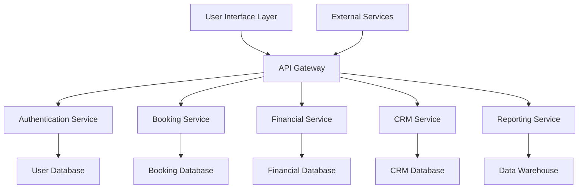
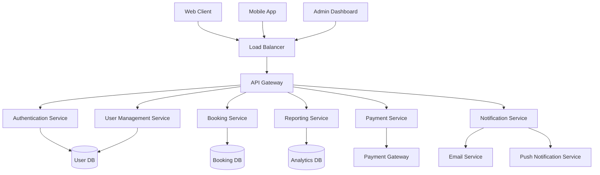
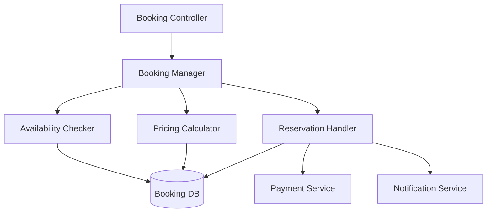
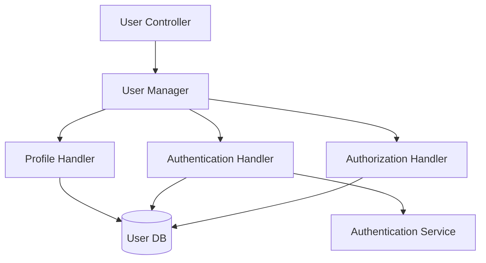
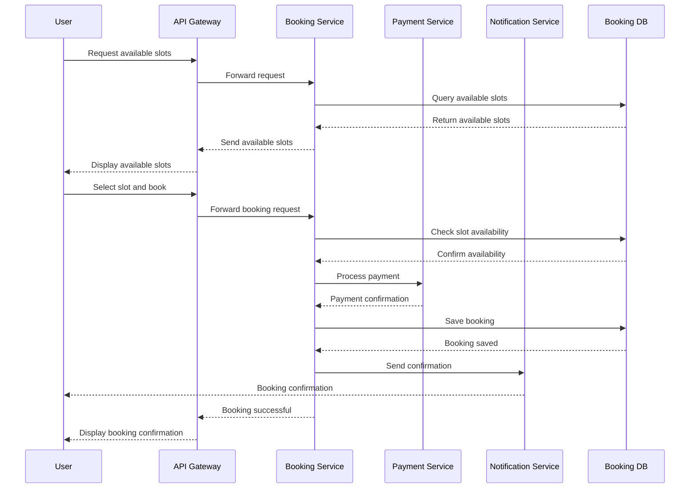
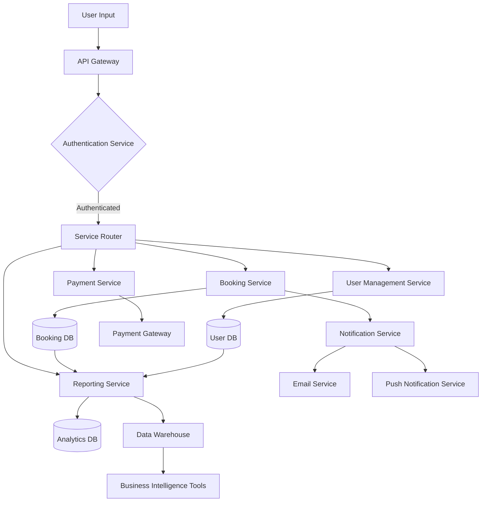
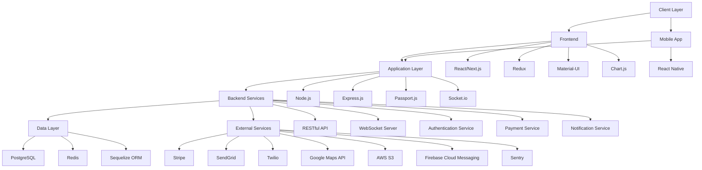
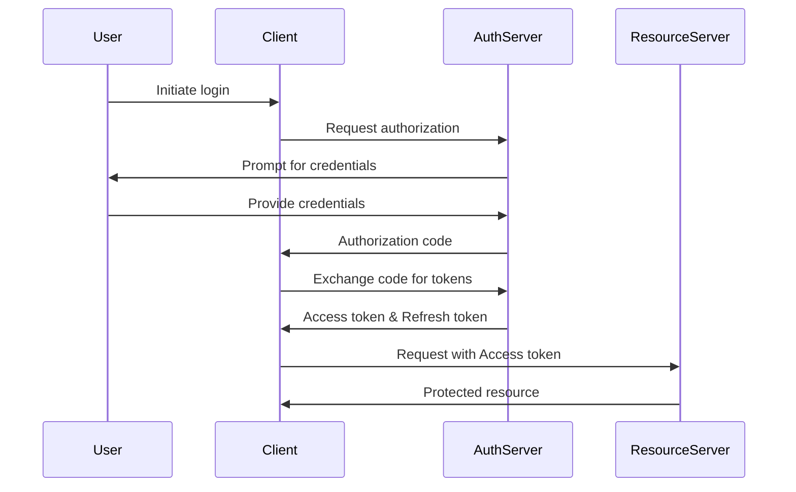
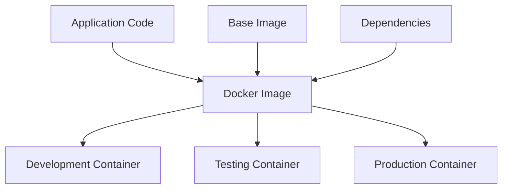
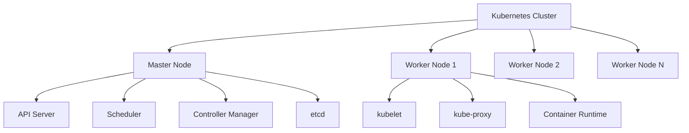

# 1. Introduction

## 1.1 System Overview

The Ice Rink Management and Booking System is a comprehensive, cloud-based software solution designed to revolutionize the management and operation of ice rinks. This all-encompassing platform integrates various aspects of ice rink operations, including scheduling, booking, financial management, customer relationship management, and facility maintenance.

The system is built on a modern, scalable architecture utilizing the following key technologies:

- Backend: Node.js with Express.js framework
- Frontend: React.js for web applications, React Native for mobile apps
- Database: PostgreSQL for primary data storage
- Caching: Redis for high-performance data caching
- API: RESTful API design with GraphQL for complex data queries
- Authentication: OAuth 2.0 and JWT for secure user authentication
- Cloud Infrastructure: AWS (Amazon Web Services) for hosting and scalability

The system is designed to be modular, allowing for easy expansion and integration with third-party services. It employs a microservices architecture to ensure scalability and maintainability of individual components.



This high-level architecture diagram illustrates the main components of the system and their interactions, showcasing the modular and scalable design.

## 1.2 Scope

The Ice Rink Management and Booking System aims to provide a complete solution for ice rink operators, addressing the complex needs of ice rink management while enhancing the user experience for both operators and customers.

### 1.2.1 Goals

1. Streamline and automate ice rink management processes
2. Optimize ice time utilization and revenue generation
3. Enhance user experience for rink operators, skaters, coaches, and teams
4. Provide a centralized platform for all aspects of ice rink operations
5. Offer real-time insights and analytics for informed decision-making

### 1.2.2 Benefits

1. Significant reduction in time and effort spent on ice time management
2. Improved resource utilization and operational efficiency
3. Increased revenue through optimized scheduling and pricing
4. Enhanced customer satisfaction and loyalty
5. Streamlined operations under a single, integrated platform
6. Data-driven insights for strategic planning and growth

### 1.2.3 Core Functionalities

The Ice Rink Management and Booking System includes the following core components and functionalities:

| Component | Description |
|-----------|-------------|
| Scheduling System | Real-time availability tracking, automated pricing, support for multiple booking types |
| Booking Platform | User-friendly interface for customers, secure online payment processing, user profiles |
| Financial Management | Comprehensive reporting, analytics, forecasting tools, POS integration |
| Customer Relationship Management | Customer data management, communication history tracking, personalized marketing tools |
| Facility Management | Equipment inventory tracking, maintenance scheduling, resource allocation |
| Marketing and Promotions | Cross-channel campaign management, ad marketplace, email integration |
| Reporting and Analytics | Customizable dashboards, KPI tracking, data visualization tools |
| Mobile Application | On-the-go access for both staff and customers |
| Integration Capabilities | APIs for third-party service integration (e.g., payment gateways, calendar applications) |

By encompassing these core functionalities, the Ice Rink Management and Booking System aims to become the new industry standard, capable of efficiently and effectively managing all aspects of ice rink operations while providing an exceptional experience for both operators and users.

# 5. SYSTEM ARCHITECTURE

## 5.1 PROGRAMMING LANGUAGES

The Ice Rink Management and Booking System will utilize the following programming languages:

| Language | Purpose | Justification |
|----------|---------|---------------|
| JavaScript (Node.js) | Backend development | Provides a fast, scalable, and event-driven runtime for building the server-side application. Allows for code sharing between frontend and backend. |
| TypeScript | Backend and Frontend development | Adds static typing to JavaScript, enhancing code quality, maintainability, and developer productivity. |
| React (JavaScript/TypeScript) | Frontend web development | Offers a component-based architecture for building interactive and responsive user interfaces. |
| React Native | Mobile app development | Enables cross-platform mobile app development using React, maximizing code reuse between web and mobile platforms. |
| SQL | Database queries | Standard language for interacting with the PostgreSQL database, ensuring efficient data retrieval and manipulation. |
| HTML5/CSS3 | Frontend markup and styling | Industry standards for structuring and styling web content, ensuring cross-browser compatibility and responsive design. |

## 5.2 HIGH-LEVEL ARCHITECTURE DIAGRAM

The following diagram provides an overview of the system's components and their interactions:



This high-level architecture diagram illustrates the microservices-based approach, with separate services for core functionalities, all accessed through an API Gateway. The system uses a load balancer to distribute traffic and separate databases for different concerns.

## 5.3 COMPONENT DIAGRAMS

### 5.3.1 Booking Service Component



This component diagram shows the internal structure of the Booking Service, highlighting the main components involved in the booking process.

### 5.3.2 User Management Service Component



This diagram illustrates the components within the User Management Service, showing how user-related operations are handled.

## 5.4 SEQUENCE DIAGRAMS

### 5.4.1 Booking Process Sequence



This sequence diagram illustrates the process of a user making a booking, including interactions with various services.

## 5.5 DATA-FLOW DIAGRAM

The following diagram explains how information moves through the Ice Rink Management and Booking System:



This data-flow diagram shows how user input is processed through various services, how data is stored and retrieved from different databases, and how information flows to generate reports and insights. It also illustrates the integration with external services like payment gateways and notification systems.

The architecture described in this section ensures a scalable, maintainable, and efficient system that can handle the complex requirements of the Ice Rink Management and Booking System. The microservices approach allows for independent scaling and updating of different components, while the use of modern technologies and programming languages ensures high performance and developer productivity.

# 5. SYSTEM DESIGN

## 5.1 PROGRAMMING LANGUAGES

The Ice Rink Management and Booking System will utilize the following programming languages:

| Language | Purpose | Justification |
|----------|---------|---------------|
| JavaScript (Node.js) | Backend development | Provides a fast, scalable, and event-driven runtime for building the server-side application. Allows for code sharing between frontend and backend. |
| TypeScript | Backend and Frontend development | Adds static typing to JavaScript, enhancing code quality, maintainability, and developer productivity. |
| React (JavaScript/TypeScript) | Frontend web development | Offers a component-based architecture for building interactive and responsive user interfaces. |
| React Native | Mobile app development | Enables cross-platform mobile app development using React, maximizing code reuse between web and mobile platforms. |
| SQL | Database queries | Standard language for interacting with the PostgreSQL database, ensuring efficient data retrieval and manipulation. |
| HTML5/CSS3 | Frontend markup and styling | Industry standards for structuring and styling web content, ensuring cross-browser compatibility and responsive design. |

## 5.2 DATABASE DESIGN

The Ice Rink Management and Booking System will use PostgreSQL as its primary database. The database schema is designed to efficiently store and retrieve data for all system components. Below is a high-level entity-relationship diagram representing the core tables and their relationships:


This schema provides a foundation for storing essential data related to rinks, users, bookings, equipment, and staff. Additional tables will be added to support features such as marketing campaigns, financial transactions, and analytics.

## 5.3 API DESIGN

The Ice Rink Management and Booking System will implement a RESTful API to facilitate communication between the frontend applications and the backend services. The API will be designed following best practices for RESTful architecture, including proper use of HTTP methods, status codes, and resource naming conventions.

Key API endpoints will include:

1. User Management
   - POST /api/users (Create user)
   - GET /api/users/{id} (Retrieve user)
   - PUT /api/users/{id} (Update user)
   - DELETE /api/users/{id} (Delete user)

2. Authentication
   - POST /api/auth/login (User login)
   - POST /api/auth/logout (User logout)
   - POST /api/auth/refresh (Refresh access token)

3. Booking Management
   - GET /api/ice-slots (List available ice slots)
   - POST /api/bookings (Create booking)
   - GET /api/bookings/{id} (Retrieve booking details)
   - PUT /api/bookings/{id} (Update booking)
   - DELETE /api/bookings/{id} (Cancel booking)

4. Equipment Management
   - GET /api/equipment (List available equipment)
   - POST /api/equipment-rentals (Create equipment rental)

5. Rink Management
   - GET /api/rinks (List rinks)
   - GET /api/rinks/{id}/schedule (Retrieve rink schedule)

The API will use JSON for data exchange and implement OAuth 2.0 with JWT for authentication and authorization. Detailed API documentation will be provided using tools like Swagger or OpenAPI Specification.

## 5.4 USER INTERFACE DESIGN

The user interface for the Ice Rink Management and Booking System will be designed to be intuitive, responsive, and accessible across various devices. Below are wireframe mockups for key interfaces:

### 5.4.1 Admin Dashboard

```
+----------------------------------+
|  Logo   Search   Notifications   |
+----------------------------------+
| |                                |
| | Dashboard                      |
| | Bookings                       |
| | Users                +--------+|
| | Equipment            | KPI 1  ||
| | Reports              +--------+|
| |                                |
| |                      +--------+|
| |                      | KPI 2  ||
| |                      +--------+|
| |                                |
| |             +-----------------+|
| |             | Upcoming        ||
| |             | Bookings        ||
| |             |                 ||
| |             +-----------------+|
+----------------------------------+
```

### 5.4.2 Customer Booking Interface

```
+----------------------------------+
|  Logo   Search   Login/Register  |
+----------------------------------+
| Available Ice Times              |
| +------------------------------+ |
| | Calendar View                | |
| |                              | |
| |  [D] [D] [D] [D] [D] [D] [D] | |
| |  [ ] [ ] [X] [ ] [ ] [X] [ ] | |
| |                              | |
| +------------------------------+ |
|                                  |
| Selected: March 15, 2023 2:00 PM |
| Duration: 1 hour                 |
| Price: $50                       |
|                                  |
| [ Book Now ]                     |
+----------------------------------+
```

### 5.4.3 Mobile App Home Screen

```
+------------------+
| Ice Rink App     |
+------------------+
| [Book Ice Time]  |
|                  |
| My Bookings      |
| +--------------+ |
| | March 15, 2PM| |
| | 1 hour       | |
| +--------------+ |
|                  |
| Upcoming Events  |
| +--------------+ |
| | Hockey Tourn.| |
| | March 20-22  | |
| +--------------+ |
|                  |
| [Rent Equipment] |
+------------------+
```

## 5.5 THEME DESIGN

The Ice Rink Management and Booking System will adopt a clean, modern, and professional design theme that reflects the cool and dynamic nature of ice sports. The color palette and design elements will be chosen to evoke a sense of ice and winter sports while maintaining high readability and accessibility.

Color Palette:
- Primary Color: Deep Blue (#0B3D91) - Representing trust and professionalism
- Secondary Color: Ice Blue (#A5D8FF) - Evoking the feeling of ice
- Accent Color: Bright Red (#FF3131) - For calls-to-action and important information
- Background Color: Light Gray (#F4F4F4) - For a clean, modern look
- Text Color: Dark Gray (#333333) - For optimal readability

Typography:
- Headings: Montserrat (sans-serif) - Bold and modern
- Body Text: Open Sans (sans-serif) - Clean and highly readable

Design Elements:
- Use of subtle ice/frost textures in backgrounds
- Rounded corners on buttons and cards for a friendly feel
- Icon set featuring ice sports equipment and symbols

Responsive Design:
- The theme will be implemented using responsive design principles to ensure a consistent look and feel across desktop, tablet, and mobile devices.

Accessibility:
- The theme will adhere to WCAG 2.1 Level AA standards, ensuring proper color contrast and readability for all users.

By implementing this theme design, the Ice Rink Management and Booking System will present a professional and appealing interface that aligns with the expectations of both rink managers and customers in the ice sports industry.

# 6. TECHNOLOGY STACK

## 6.1 PROGRAMMING LANGUAGES

The Ice Rink Management and Booking System will utilize the following programming languages:

| Language | Purpose | Justification |
|----------|---------|---------------|
| JavaScript (Node.js) | Backend development | Provides a fast, scalable, and event-driven runtime for building the server-side application. Allows for code sharing between frontend and backend. |
| TypeScript | Backend and Frontend development | Adds static typing to JavaScript, enhancing code quality, maintainability, and developer productivity. |
| React (JavaScript/TypeScript) | Frontend web development | Offers a component-based architecture for building interactive and responsive user interfaces. |
| React Native | Mobile app development | Enables cross-platform mobile app development using React, maximizing code reuse between web and mobile platforms. |
| SQL | Database queries | Standard language for interacting with the PostgreSQL database, ensuring efficient data retrieval and manipulation. |
| HTML5/CSS3 | Frontend markup and styling | Industry standards for structuring and styling web content, ensuring cross-browser compatibility and responsive design. |

## 6.2 FRAMEWORKS AND LIBRARIES

The following frameworks and libraries will be utilized in the development of the Ice Rink Management and Booking System:

| Framework/Library | Purpose | Justification |
|-------------------|---------|---------------|
| Express.js | Backend web framework | Lightweight and flexible framework for building robust APIs and web applications in Node.js. |
| Next.js | React framework | Provides server-side rendering, routing, and optimized performance for React applications. |
| Redux | State management | Offers predictable state management for complex React applications, enhancing maintainability. |
| Jest | Testing framework | Comprehensive testing solution for JavaScript applications, ensuring code quality and reliability. |
| Sequelize | ORM (Object-Relational Mapping) | Simplifies database operations and provides an abstraction layer for working with PostgreSQL. |
| Passport.js | Authentication middleware | Flexible authentication solution supporting various strategies, including OAuth 2.0. |
| Socket.io | Real-time communication | Enables real-time, bidirectional communication between web clients and servers. |
| Chart.js | Data visualization | Powerful and flexible charting library for creating interactive and responsive charts. |
| Material-UI | UI component library | Provides a comprehensive set of pre-built React components following Material Design principles. |

## 6.3 DATABASES

The Ice Rink Management and Booking System will employ the following database systems:

| Database | Purpose | Justification |
|----------|---------|---------------|
| PostgreSQL | Primary relational database | Robust, open-source RDBMS with strong support for complex queries, transactions, and data integrity. |
| Redis | Caching and session storage | In-memory data structure store, providing high-performance caching and real-time data management. |

## 6.4 THIRD-PARTY SERVICES

The system will integrate the following external services and APIs:

| Service | Purpose | Justification |
|---------|---------|---------------|
| Stripe | Payment processing | Secure and widely-adopted payment gateway with comprehensive API for handling online transactions. |
| SendGrid | Email service | Reliable email delivery service with robust API for sending transactional and marketing emails. |
| Twilio | SMS notifications | Provides APIs for sending SMS notifications and implementing two-factor authentication. |
| Google Maps API | Location services | Enables integration of mapping and location-based features for rink locations and directions. |
| AWS S3 | File storage | Scalable and secure cloud storage solution for storing and serving user-uploaded files and documents. |
| Firebase Cloud Messaging | Push notifications | Cross-platform solution for sending push notifications to mobile devices. |
| Sentry | Error tracking and monitoring | Real-time error tracking and performance monitoring to ensure system reliability and quick issue resolution. |

## 6.5 TECHNOLOGY STACK DIAGRAM

The following diagram illustrates the overall technology stack of the Ice Rink Management and Booking System:



This technology stack provides a robust, scalable, and maintainable foundation for the Ice Rink Management and Booking System. It leverages modern technologies and industry-standard practices to ensure high performance, security, and developer productivity throughout the development and maintenance of the system.

# 7. SECURITY CONSIDERATIONS

## 7.1 AUTHENTICATION AND AUTHORIZATION

The Ice Rink Management and Booking System will implement a robust authentication and authorization mechanism to ensure secure access to the system and its resources.

### 7.1.1 Authentication

The system will use OAuth 2.0 with JSON Web Tokens (JWT) for user authentication. This approach provides a secure and scalable solution for managing user identities across the web and mobile applications.

Authentication flow:



Key authentication features:
- Multi-factor authentication (MFA) for admin and staff accounts
- Password complexity requirements (minimum 12 characters, mix of uppercase, lowercase, numbers, and special characters)
- Account lockout after 5 failed login attempts
- Password reset functionality with secure email-based verification

### 7.1.2 Authorization

The system will implement Role-Based Access Control (RBAC) to manage user permissions effectively. The following roles will be defined:

| Role | Description | Access Level |
|------|-------------|--------------|
| Super Admin | System-wide access | Full access to all features and data |
| Rink Manager | Manage single rink | Full access to rink-specific features and data |
| Staff | Operational tasks | Limited access based on job function |
| Coach | Booking and client management | Access to scheduling and client data |
| Customer | Book ice time and services | Access to personal bookings and public information |

Authorization will be enforced at both the API and UI levels to ensure consistent security across all system interfaces.

## 7.2 DATA SECURITY

Protecting sensitive information is crucial for maintaining user trust and complying with data protection regulations.

### 7.2.1 Data Encryption

- All data at rest will be encrypted using AES-256 encryption.
- Data in transit will be protected using TLS 1.3 encryption.
- Database-level encryption will be implemented for an additional layer of security.

### 7.2.2 Personal Data Protection

- Personal Identifiable Information (PII) will be stored in compliance with GDPR and CCPA regulations.
- Data minimization principles will be applied to collect and store only necessary information.
- Data retention policies will be implemented to automatically delete or anonymize data that is no longer needed.

### 7.2.3 Payment Information Security

- The system will be PCI DSS compliant for handling credit card information.
- Credit card details will not be stored on the system; instead, tokenization will be used with the payment gateway.

### 7.2.4 Data Access and Auditing

- All access to sensitive data will be logged and monitored.
- Regular audits will be conducted to ensure proper data access controls are maintained.

## 7.3 SECURITY PROTOCOLS

The following security protocols will be implemented to maintain the overall security of the Ice Rink Management and Booking System:

### 7.3.1 Network Security

- Firewalls will be configured to restrict inbound and outbound traffic.
- Intrusion Detection and Prevention Systems (IDS/IPS) will be deployed to monitor and block suspicious activities.
- Virtual Private Networks (VPNs) will be used for secure remote access to the system.

### 7.3.2 Application Security

- Regular security updates and patches will be applied to all system components.
- Input validation and sanitization will be implemented to prevent injection attacks.
- Cross-Site Scripting (XSS) and Cross-Site Request Forgery (CSRF) protections will be in place.

### 7.3.3 API Security

- API rate limiting will be implemented to prevent abuse and DDoS attacks.
- API endpoints will be monitored for unusual activity patterns.
- API keys will be used for external integrations, with the ability to revoke or rotate keys as needed.

### 7.3.4 Security Testing and Monitoring

| Activity | Frequency | Description |
|----------|-----------|-------------|
| Vulnerability Scanning | Weekly | Automated scans to identify potential vulnerabilities |
| Penetration Testing | Bi-annually | Simulated attacks to test system defenses |
| Security Code Review | Continuous | Automated and manual review of code changes |
| Security Incident Response Drills | Quarterly | Simulated security incidents to test response procedures |

### 7.3.5 Compliance and Certifications

The system will adhere to the following security standards and certifications:

- ISO 27001 Information Security Management
- OWASP Top 10 security risks mitigation
- GDPR and CCPA compliance for data protection
- PCI DSS compliance for payment card security

### 7.3.6 Security Awareness and Training

- All staff members will undergo regular security awareness training.
- Developers will receive specialized secure coding training.
- Security policies and procedures will be documented and regularly updated.

By implementing these comprehensive security measures, the Ice Rink Management and Booking System will maintain a strong security posture, protecting sensitive data and ensuring the trust of its users and stakeholders.

# 7. INFRASTRUCTURE

## 7.1 DEPLOYMENT ENVIRONMENT

The Ice Rink Management and Booking System will be deployed primarily in a cloud environment to ensure scalability, reliability, and ease of management. A hybrid approach will be considered for certain components that may require on-premises deployment due to specific regulatory or performance requirements.

| Environment | Description | Justification |
|-------------|-------------|---------------|
| Cloud | Primary deployment environment | Offers scalability, high availability, and reduced infrastructure management overhead |
| On-premises | Limited deployment for specific components | May be required for certain data storage or processing needs due to regulatory compliance |
| Hybrid | Combination of cloud and on-premises | Provides flexibility to leverage cloud benefits while maintaining control over sensitive operations |

## 7.2 CLOUD SERVICES

The system will utilize Amazon Web Services (AWS) as the primary cloud service provider due to its comprehensive service offerings, global presence, and robust security features.

| AWS Service | Purpose | Justification |
|-------------|---------|---------------|
| Amazon EC2 | Compute instances for application servers | Scalable and flexible compute capacity |
| Amazon RDS for PostgreSQL | Managed database service | Simplifies database administration and scaling |
| Amazon ElastiCache for Redis | In-memory caching | Improves application performance |
| Amazon S3 | Object storage for files and backups | Durable and cost-effective storage solution |
| Amazon CloudFront | Content Delivery Network (CDN) | Improves global content delivery and reduces latency |
| AWS Lambda | Serverless compute for specific functions | Enables event-driven architecture and reduces operational complexity |
| Amazon SQS | Message queuing service | Facilitates decoupling of system components |
| AWS Elastic Beanstalk | Application deployment and management | Simplifies deployment and scaling of web applications |

## 7.3 CONTAINERIZATION

The Ice Rink Management and Booking System will utilize Docker for containerization to ensure consistency across development, testing, and production environments.



Key benefits of using Docker:
1. Consistency across environments
2. Improved developer productivity
3. Efficient resource utilization
4. Simplified deployment and scaling

## 7.4 ORCHESTRATION

Kubernetes will be used for container orchestration to manage the deployment, scaling, and operations of application containers across clusters of hosts.



Key features of Kubernetes orchestration:
1. Automated rollouts and rollbacks
2. Self-healing capabilities
3. Horizontal scaling
4. Service discovery and load balancing
5. Secret and configuration management

## 7.5 CI/CD PIPELINE

The continuous integration and continuous deployment (CI/CD) pipeline will be implemented using AWS CodePipeline in conjunction with other AWS services to automate the build, test, and deployment processes.


| Stage | Tool/Service | Purpose |
|-------|--------------|---------|
| Source Control | GitHub | Version control and collaboration |
| CI/CD Orchestration | AWS CodePipeline | Manage and visualize the entire CI/CD workflow |
| Build | AWS CodeBuild | Compile source code, run tests, and produce deployment artifacts |
| Testing | Jest, Selenium | Automated unit and integration testing |
| Deployment | AWS CodeDeploy | Automate application deployments to EC2 instances or ECS |
| Infrastructure as Code | AWS CloudFormation | Define and provision AWS infrastructure resources |
| Monitoring | AWS CloudWatch | Monitor application and infrastructure performance |

Key features of the CI/CD pipeline:
1. Automated builds triggered by code commits
2. Comprehensive testing at multiple stages
3. Staged deployments (development, staging, production)
4. Automated rollbacks in case of deployment failures
5. Integration with monitoring and alerting systems

This infrastructure setup ensures a robust, scalable, and maintainable deployment environment for the Ice Rink Management and Booking System, leveraging cloud services, containerization, and modern DevOps practices to streamline development and operations.